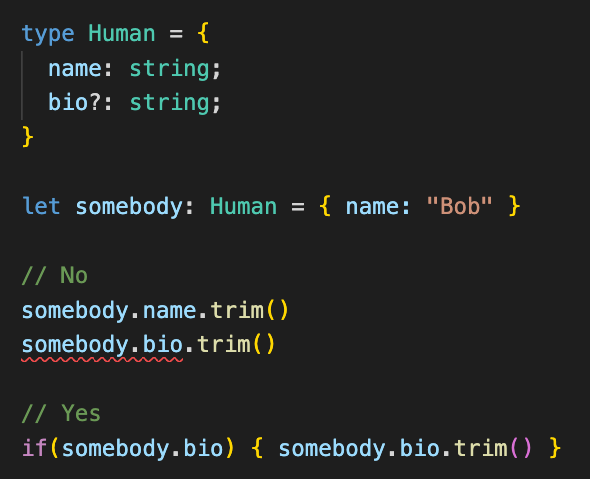
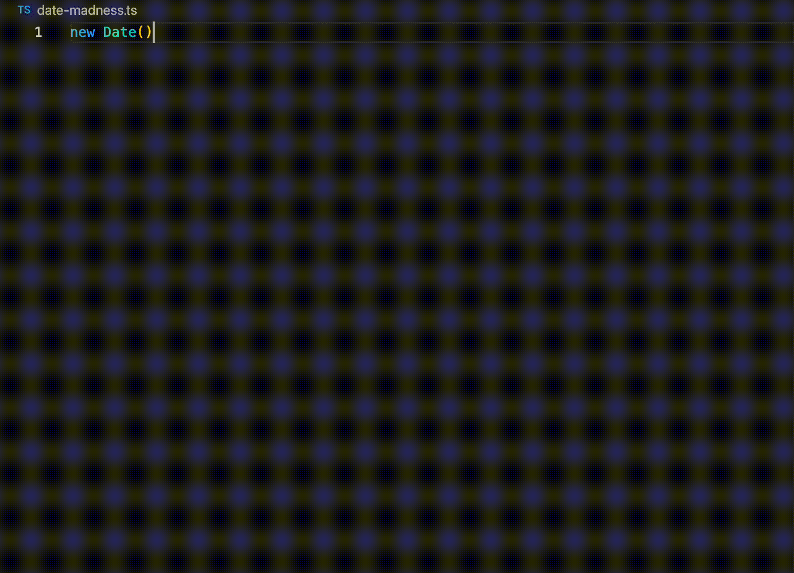

# TypeScript, GraphQL, Codegen

:heart: Amics Per Sempre :heart:

---

# :adult:

```json
{
  "nom": "Josep Jaume",
  "tipus": "desenvolupador de pila completa",
  "motCurt": "@josepjaume",
  "treballoA": ["C̶o̶d̶e̶g̶r̶a̶m̶", "Factorial"],
  "liosVaris": ["Espetech Cast", "Full Stack Vallès"]
}
```

---

# :book: Glossari

---


---


---


---


---


---

# :hand:

---

- Superset de JavaScript
- Estàticament tipat
- Força llest
- Creat per Micro$oft el 2012

---

<!-- backgroundColor: #1e1e1e -->



---

<!-- backgroundColor: default -->
<!-- class: default -->


---

<!-- backgroundColor: #1b1b1b -->
<!-- class: invert -->



---

<!-- backgroundColor: default -->
<!-- class: default -->


---

<!-- class: invert -->

# :hand:

---

- Un llenguatge de consulta
- És una especificació
- Fortament Tipat
- Creat per ~~Facebook~~ Meta el 2015

---

Esquema del servidor

```graphql
type Human {
  name: String!
  colleagues: [Human]
}

type Meetup {
  date: Date!
  attendees: [Human]
}

type Query {
  meetups(last: Int): [Meetup!]
}
```

---

POST /graphql

```grapqhl
query GetMeetups {
  meetups(last: 2) {
    date
    attendees {
      name
      colleagues {
        name
      }
    }
  }
}
```

---

```json
{
  "meetups" => [
    {
      "date": "2021-11-24T19:54:11.769Z",
      "attendees": [
        { "name": "Anna" },
        { "name": "Núria" }
      ]
    },
    {
      "date": "2021-12-24T19:54:11.769Z",
      "attendees": []
    }
  ]
}
```

---


---


---

<!-- class: default -->


---

<!-- class: invert -->

- Sistema que genera codi per nosaltres
- Pensat per gent mandrosa
- Som gent mandrosa

---

Esquema de GraphQL

```graphql
type Human {
  name: String!
  bio: String
  colleagues: [Human!]!
}

type Meetup {
  date: Date!
  attendees: [Human!]!
}

type Query {
  meetups(last: Int): [Meetup!]!
}
```

---

Codi generat

```typescript
export type Human = {
  __typename?: "Human";
  name: Scalars["String"];
  colleagues?: Maybe<Array<Maybe<Human>>>;
};

export type Meetup = {
  __typename?: "Meetup";
  date: Scalars["Date"];
  attendees?: Maybe<Array<Maybe<Human>>>;
};

export type Query = {
  __typename?: "Query";
  meetups?: Maybe<Array<Meetup>>;
};
```

---


---


---

# :keyboard: Codi en directe :keyboard:

---

https://rickandmortyapi.com/graphql

https://github.com/josepjaume/typescript-graphql-codegen-demo

---

# Què hi hem guanyat? :thinking:

---

- Garantia de no trencar el contracte amb la API
- Demanem les dades exactes, ni més ni menys
- Tenim dades d'ús per cada camp
- Desacoplem consumidor de productor
- Podem donar la turra amb tot això

---


---

# Gràcies :heart:

```json
{
  "email": "josepjaume@gmail.com",
  "shitPosting": "twitter.com/josepjaume"
}
```

Estem contractant! 👀

https://factorialhr.com/
